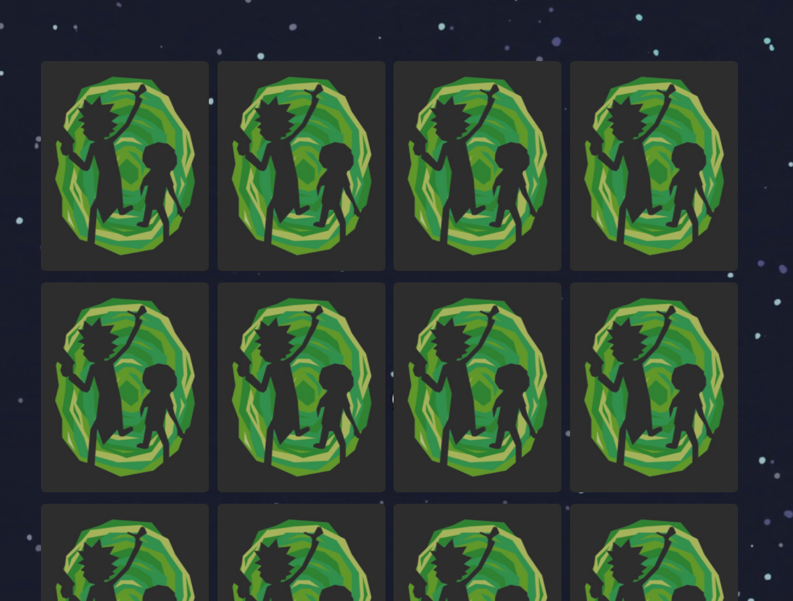

# workshop-academic-geek
En este repositorio encontraras el diagrama de modelo entidad-relacion de una empresa de modisteria, y encontraras el codigo de memorias de rick y morty

Diagrama modelo entidad-relacion Empresa Don Samuel de modisteria

Juego de la memoria Rick y Morty
- Codigo [rick-morty-project](https://github.com/plmlmontano/workshop-academic-geek/tree/main/rick_morty_project)

- Github Page [Juego de la memoria](https://plmlmontano.github.io/workshop-academic-geek/rick_morty_project/index.html)

- 